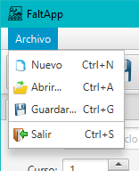
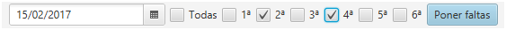

# FaltApp

Examen del módulo profesional **Desarrollo de Interfaces**.

## Descripción

Implementar una aplicación con GUI empleando el framework JavaFX que permita el **control de faltas de asistencia y retrasos de un grupo de alumnos**. 

Se deberá aplicar el patrón de diseño **MVC (Modelo-Vista-Controlador)**, y las vistas deberán implementarse en FXML.

Así mismo, será posible guardar/abrir el grupo en/desde un fichero XML con extensión `.faltas`.

## Modelo de datos

El modelo de datos que deberá gestionar la aplicación es el siguiente:


>  Las clases del modelo de datos serán provistas por el profesor en el paquete `dad.javafx.faltapp.model`.

El significado de cada clase es el siguiente:

- **Grupo**: Elemento raíz del modelo. Representa al grupo de alumnos. Se utiliza como contenedor de alumnos y para guardar y cargar el modelo desde ficheros XML.
  - **ciclo**: Nombre del ciclo formativo al que pertenece el grupo.
  - **curso**: Número de curso del grupo (sólo puede ser 1º ó 2º)
  - **modulo**: Módulo del que se van a registrar las faltas.
  - **guardar(fichero : File)**: método que guarda el grupo en el fichero especificado.
  - **leer(path : File)**: método que lee el grupo desde el fichero XML y lo devuelve.
  - **toString()**: devuelve la información del grupo en formato `curso + "º de " + ciclo`.
  
- **Alumno**: Alumno perteneciente al grupo.
  - **nombre**: Nombre del alumno.
  - **apellidos**: Apellidos del alumno.
  - **nombreCompleto**: Nombre completo del alumno (propiedad de sólo lectura que devuelve `nombre + " " + apellidos`)
  - **fechaNacimiento**: Fecha de nacimiento del alumno.
  - **toString()**: devuelve el nombre completo del alumno.
  - **equals(alumno: Alumno)**: comprueba si dos alumnos son iguales.
  
- **Falta**: Falta de asistencia asociada a un alumno.
  - **fecha**: Día en que se produjo la falta o retraso.
  - **hora**: Hora en que se produjo la falta o retraso (de 1ª a 6ª).
  - **retraso**: Si es falso, se trata de una falta. Si es verdadero, es un retraso (el alumno llegó tarde).
  - **toString()**: devuelve la información de la falta en formato `fecha + " a " + hora + "º hora " + (retraso ? " (retraso)" : "")`.
  - **equals(falta: Falta)**: comprueba si dos faltas son iguales.

### Ejemplo de uso del modelo de datos

El siguiente código crea un modelo con el grupo "2ºDAM”, con 2 alumnos y cada uno con 2 faltas:

 ```java
Alumno a1 = new Alumno();                                    // crea un nuevo alumno
a1.setNombre("Chuck");                                       // establece su nombre
a1.setApellidos("Norris");                                   // establece sus apellidos  
a1.setCial("123456789A");                                    // establece su CIAL
a1.setFechaNacimiento(LocalDate.of(1940,  3, 10));           // establece su fecha de nacimiento
a1.getFaltas().add(new Falta(LocalDate.now(), 2, true));     // le pone retraso hoy a 2ª hora
a1.getFaltas().add(new Falta(LocalDate.now().minusDays(4),  5, false)); // le pone falta hace 4 días a 5ª hora 

Alumno a2 = new Alumno();                                    // crea otro alumno
a2.setNombre("David");  
a2.setApellidos("Carradine");  
a2.setCial("987654321Z");  
a2.setFechaNacimiento(LocalDate.of(1936,  12, 8));  
a2.getFaltas().add(new Falta(LocalDate.now().minusMonths(2),  4, true));  
a2.getFaltas().add(new Falta(LocalDate.now().minusDays(4),  4, false));     

Grupo dam2 = new Grupo();                                    // crea un nuevo grupo
dam2.setCiclo("Desarrollo de Aplicaciones Multiplataforma"); // establece el nombre del ciclo al que pertenece el grupo
dam2.setCurso(2);                                            // establece el curso del grupo
dam2.setModulo("Desarrollo de Interfaces");                  // establece la denominación del módulo
dam2.getAlumnos().addAll(a1, a2);                            // añade los alumnos anteriores al grupo

dam2.guardar(new File("dam2.faltas"));                       // guarda el grupo en el fichero "dam2.faltas"
 ```

## La interfaz de la aplicación

- Al iniciar la aplicación se deberá abrir la ventana de la aplicación, que deberá tener el siguiente aspecto: 

   

> **Todos los márgenes y espaciados entre componentes será de 5 píxeles.**

## Barra de menú

La aplicación contará con una barra de menú con las siguientes opciones:



Todas las opciones tendrán:

- **Icono** de 16x16 píxeles de tamaño.

- **Acelerador** (combinación de teclas que ejecuta la opción – CTRL+N para "Nuevo”, por ejemplo).

- **Mnemónico** que permite ejecutar la opción al pulsar la tecla ALT + la tecla subrayada (_Archivo, _Nuevo, _Abrir..., _Guardar…, _Salir).

La funcionalidad de cada una de las opciones es la siguiente:

### Nuevo

- Se creará un grupo nuevo.

- Se deberá pedir confirmación antes de crear el modelo nuevo con un diálogo como el siguiente:

  

- Recuerda desvincular el modelo viejo antes de vincular el nuevo (unbind-bind).

### Abrir

- Se abrirá un grupo desde fichero.

- Como puede haber pérdida de datos al sobrescribir el grupo existente, se pedirá confirmación antes de abrir el grupo nuevo:

  

- Si se "acepta" en el diálogo anterior, se abrirá un **FileChooser** para elegir el fichero a abrir:

  

- El **FileChooser** se deberá configurar de la siguiente forma:

  - Deberá tener dos filtros (ExtensionFilter): 
    - *Faltas (\*.faltas)*
    - *Todos los archivos (\*.\*)*
  - Deberá tener el icono de la aplicación y bloquear a la ventana principal de la aplicación.

- Recuerda desvincular el grupo viejo antes de vincular el que acabas de abrir (unbind-bind).

- Para abrir el grupo disponemos del método estático `Grupo.leer(File fichero)`.

- Si se abre correctamente el archivo se mostrará el siguiente mensaje:

  

- En caso de error, se mostrará el siguiente mensaje, donde `e.getMessage()` es el mensaje de la excepción:

  

### Guardar

- Se guardará el grupo actual en un fichero.

- Se abrirá un **FileChooser** para elegir donde guardar el fichero:

  

- El **FileChooser** se deberá configurar de la siguiente forma:
  - Deberá tener dos filtros (ExtensionFilter): 
    - *Faltas (\*.faltas)*
    - *Todos los archivos (\*.\*)*
  - Deberá tener el icono de la aplicación.
- Para guardar el modelo disponemos del método `guardar(File fichero)` del grupo.

- Si se guardar correctamente el archivo se mostrará el siguiente mensaje:

  

- En caso de error, se mostrará el siguiente mensaje donde `e.getMessage()` es el mensaje de error de la excepción:

  

### Salir

- Terminará la aplicación.

- Se deberá pedir confirmación al usuario para evitar la pérdida de datos, con un mensaje como el siguiente:

  

- Esta confirmación también se deberá abrir al cerrar la ventana principal de la aplicación en el botón :x:.

  ```java
  primaryStage.setOnCloseRequest(e -> {
      // TODO pedir confirmación al usuario
      e.consume(); // esta instrucción consume/elimina el evento de cerrar la ventana, lo que impide que se cierre
  });
  ```

## Barra de herramientas

La aplicación tendrá también una barra de herramientas con los siguientes botones:


La funcionalidad de estos botones es exactamente la misma que las opciones del menú **Archivo** (consultar apartado **Barra de menú** para más información). 

> Para poner iconos a los botones debemos añadirles un `ImageView` y dejarlos sin texto.

## Pestaña "Grupo"

- Desde esta pestaña se podrá gestionar toda la información del grupo (ciclo, curso, alumnos matriculados,…). 

### Panel con formulario de gestión de datos del grupo

Formulario desde el que se editan los datos del grupo (ciclo, curso y módulo).


- El **Curso** sólo podrá tener valores enteros entre 1 y 2.

  ```java
  // declaración del componente Spinner<T> en el controlador
  @FXML
  Spinner<Integer> cursoSpinner;
  
  // configurar el rango de posibles valores
  cursoSpinner.setValueFactory(
      new SpinnerValueFactory.IntegerSpinnerValueFactory(1, 2)
  );
  
  // ej. de bindeo a la propiedad que devuelve el valor del spinner	cursoSpinner.getValueFactory().valueProperty().bindBidirectional(
  	grupo.cursoProperty().asObject()
  );
  ```

- Los campos de texto **Ciclo** y **Módulo** deben mostrar un *prompt* (mensaje que se presenta cuando están vacíos), tal y como se muestra en la imagen anterior.

### Panel de gestión de alumnos del grupo

Debajo del panel con el formulario de los datos del grupo se mostrará una tabla con todos los alumnos matriculados en el grupo.


- La tabla será editable, es decir, todos y cada uno de los valores de los alumnos se podrán modificar desde la misma tabla.

  

- La columna **Fecha nacimiento** (de tipo `LocalDate`) se deberá poder editar en formato corto (DD/MM/AAAA); suponiendo que el campo se llame `fechaNacimientoColumn`, se deberá configurar la columna de la siguiente forma:

```java
fechaNacimientoColumn.setCellFactory(
	TextFieldTableCell.forTableColumn(
		new LocalDateStringConverter(FormatStyle.SHORT)
	)
);
```

#### Añadir alumno

- Al pulsar el botón "Añadir” se añadirá un alumno nuevo al grupo con los siguientes valores por defecto:

  - **CIAL**: Se generará uno automáticamente utilizando el siguiente fragmento de código:

    ```java
    String cial = UUID.randomUUID().toString().split("-")[0].toUpperCase());
    ```

- **Nombre**: En el campo del nombre de pondrá la cadena "Nombre”.

- **Apellidos**: En el campo de los apellidos se pondrá la cadena "Apellidos”.

- **Fecha de nacimiento**: En el campo de fecha de nacimiento se podrá la fecha actual del sistema.

- Tras añadir el alumno, se seleccionará automáticamente en la tabla y ésta tendrá el foco (`requestFocus()`):

  

#### Eliminar alumno

- Se podrá seleccionar sólo 1alumno de la tabla.

- Al pulsar el botón **Eliminar** se eliminará el alumno seleccionado.

- El botón se activará sólo cuando haya un elemento seleccionado en la tabla.

	

	

- Se deberá pedir confirmación antes de eliminar al alumno con un mensaje como el siguiente:

  

> **NOTA**: Para deseleccionar un elemento, pulsamos CTRL a la vez que hacemos clic sobre el elemento de la tabla.

### Panel de gestión de faltas del alumno

- Este panel muestra las faltas registradas para un alumno:


- Al seleccionar un alumno en la tabla de alumnos, en la tabla de faltas saldrán las faltas o retrasos que se han añadido al mismo:

  

- Si seleccionamos faltas de la tabla de faltas y pulsamos la tecla SUPR (DELETE) se eliminarán.

  

> **NOTA**: Debemos capturar el evento "KeyPressed” de la tabla como se muestra a continuación:

```java
@FXML
void onFaltasTableKeyPressed(KeyEvent event) {
	if (event.getCode().equals(KeyCode.DELETE)) {
		// TODO eliminar las faltas seleccionadas
	}
}
```

- Se deberá pedir confirmación antes de eliminarlas, tal y como se observa en la siguiente imagen:

  

## Pestaña "Pasar lista"

Desde esta pestaña se podrá pasar lista para todos los alumnos del grupo.


- En la tabla aparecerán todos los alumnos del grupo.

### Poner faltas

- El botón **Poner faltas** se activa si se introduce una fecha y se selecciona al menos una hora.

  

- Si se marca la casilla **Todas** se marcarán todas las horas y se deshabilitarán.

  

- Si se desmarca la casilla **Todas** se desmarcarán todas las horas y se volverán a habilitar.

  

- Cuando se pulse el botón **Poner faltas** se añadirá una falta o retraso a cada alumno, en las horas y el día seleccionado.

  

- No se podrá seleccionar *RETRASO* y *FALTA* a la vez. Si se marca uno, se desmarcará el otro.

  >  *En el ejemplo anterior, se crearán:* 
  >    - 2 retrasos para "Chuck Norris" a 1ª y 6ª el día 15/2/2017.
  >    - 2 faltas para "David Carradine" a 1ª y 6ª el día 15/2/2017.
  
  

- Tras ponerse las faltas a los alumnos, se reiniciarán todos los campos del panel:
  - Se vaciará la fecha (`DatePicker`).
  - Se desmarcarán todas las casillas de verificación de las horas (`CheckBox`).
  - Se desmarcarán todas las faltas y retrasos de la tabla.

  

## Criterios de calificación

| **Criterios**                                                | **Puntuación** |
| ------------------------------------------------------------ | -------------- |
| **Barra de  menú**                                           | -              |
| Diseño (aceleradores +  mnemónicos + iconos + separador)     | 5              |
| **Barra de  herramientas**                                   | -              |
| Diseño (iconos + separador)                                  | 5              |
| **Funcionalidad  de las opciones del menú "Archivo" y botones barra de herramientas** | -              |
| Nuevo grupo                                                  | 3              |
| Abrir modelo                                                 | 6              |
| Guardar modelo                                               | 6              |
| Salir                                                        | 2              |
| **Pestaña  "Grupo"**                                         | -              |
| --- *Formulario datos "Grupo"* ---                           | -              |
| Diseño (campos, bordes,  límites spinner) + vinculación modelo | 5              |
| --- *Tabla "Alumnos"*  ---                                   | -              |
| Diseño (columnas, bordes, espaciado)  + vinculación modelo   | 5              |
| Añadir alumno (añadir modelo +  tabla + seleccionar + foco)  | 8              |
| Eliminar alumno (eliminar  modelo + tabla + confirmación + deshabilitar botón) | 8              |
| --- *Tabla "Faltas"* ---                                     | -              |
| Diseño (columnas, bordes,  espaciado, panel con título)      | 5              |
| Vinculación/Desvinculación con  faltas alumno seleccionado   | 8              |
| Eliminar faltas con tecla SUPR  (confirmación)               | 8              |
| **Pestaña "Pasar lista"**                                    | -              |
| Diseño + vinculación modelo                                  | 5              |
| Habilitar/Deshabilitar botón  "Pasar lista"                  | 7              |
| Casilla de verificación  "Todos"                             | 7              |
| Crear faltas y retrasos                                      | 8              |
| **Total**                                                    | **100**        |

> **El profesor determinará el grado de cumplimiento de cada apartado a partir de la ejecución de la aplicación, por lo que es sumamente importante que los apartados que queremos que puntúen se puedan probar.** 

